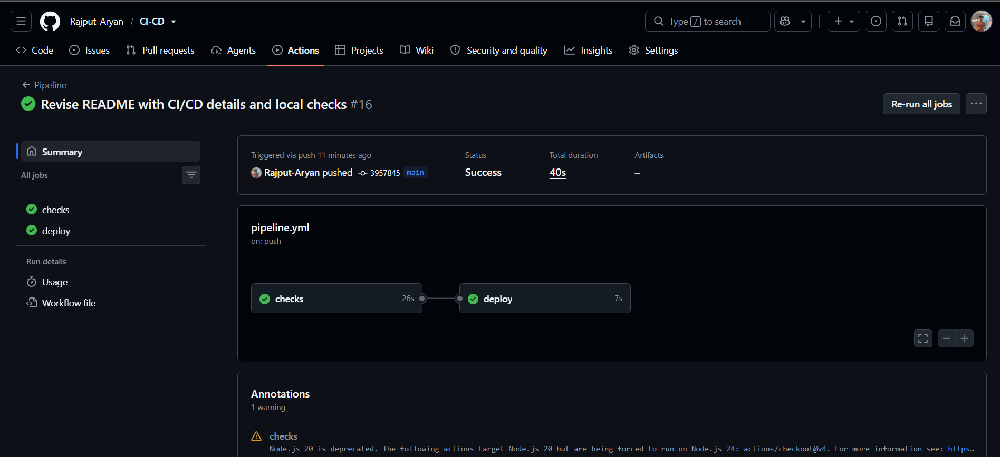
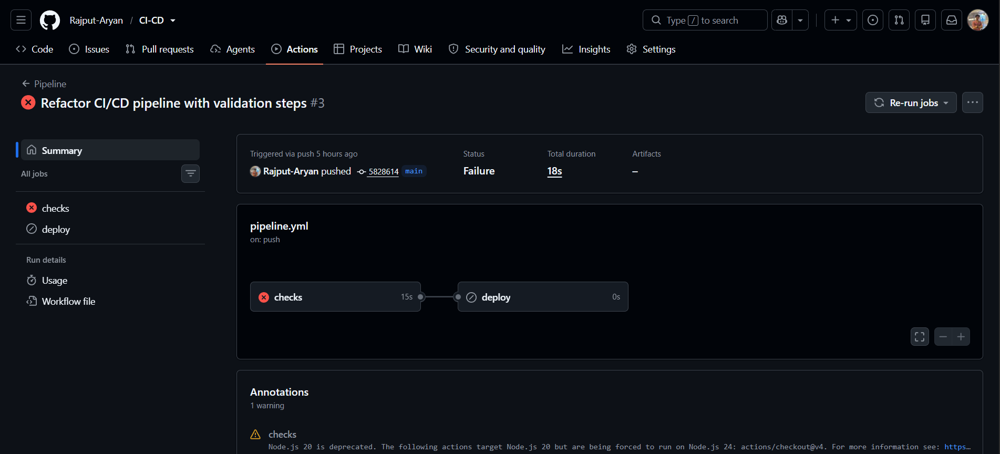

# Personal Portfolio — with an Automated CI/CD Pipeline

This repo hosts my personal portfolio website, deployed live on Vercel. What makes it more than "just a static site" is the pipeline behind it: every change is automatically checked before it's ever allowed to go live.

**Live site:** [https://ci-cd-git-main-diamond-85c1.vercel.app/](#)

---

## What is CI/CD?

**CI (Continuous Integration)** means every time code changes, it's automatically tested — instead of a person having to remember to check it manually.

**CD (Continuous Deployment)** means that once those checks pass, the change goes live automatically — no manual "click deploy" step required.

Put together, CI/CD is what lets a team (or a solo developer) push code confidently: broken code gets caught *before* it reaches real users, and working code reaches them without delay.

## How This Project Implements It

```
Push to main
     │
     ▼
GitHub Actions runs "checks"
     │
     ├── HTML validation (catches broken/invalid markup)
     │
     ▼
   Passed?
   ├── No  → Pipeline stops here. Nothing deploys. ❌
   └── Yes → "deploy" job runs
              │
              ▼
      Triggers a Vercel Deploy Hook
              │
              ▼
      Vercel builds and publishes the new version ✅
```

**The key design decision:** Vercel's own automatic "deploy on every push" feature is turned **off**. The *only* way a deployment happens is if GitHub Actions calls a private Deploy Hook URL — and it only calls that hook after the `checks` job has succeeded. This is enforced directly in the workflow file with:

```yaml
deploy:
  needs: checks
  if: github.event_name == 'push' && github.ref == 'refs/heads/main'
```

`needs: checks` means the `deploy` job is not merely discouraged from running before checks pass — it structurally cannot start until they do. If `checks` fails, GitHub's scheduler never triggers `deploy` at all.

## The Pipeline in Action

**A successful run** — checks pass, deploy fires automatically:



**A failed run** — checks fail, deploy is correctly skipped and nothing broken reaches production:



This second screenshot is the actual proof this isn't just decorative automation — when the HTML validation step failed, the pipeline stopped itself. The `deploy` job never ran, and the live site was never touched.

## Tech Stack

| Layer | Tool |
|---|---|
| Frontend | Plain HTML, CSS, JavaScript |
| Hosting | Vercel |
| CI/CD | GitHub Actions |
| Validation | html5validator |
| Deploy trigger | Vercel Deploy Hooks |

## Repository Structure

```
CI-CD/
├── personal profile/
│   ├── index.html
│   ├── styles.css
│   └── script.js
├── .github/
│   └── workflows/
│       └── pipeline.yml
└── README.md
```

## Running Checks Locally

If you want to validate the HTML yourself before pushing:

```bash
pip install html5validator
html5validator --root "personal profile"
```

---

*Built as a hands-on exercise in setting up real CI/CD — not just reading about it.*
