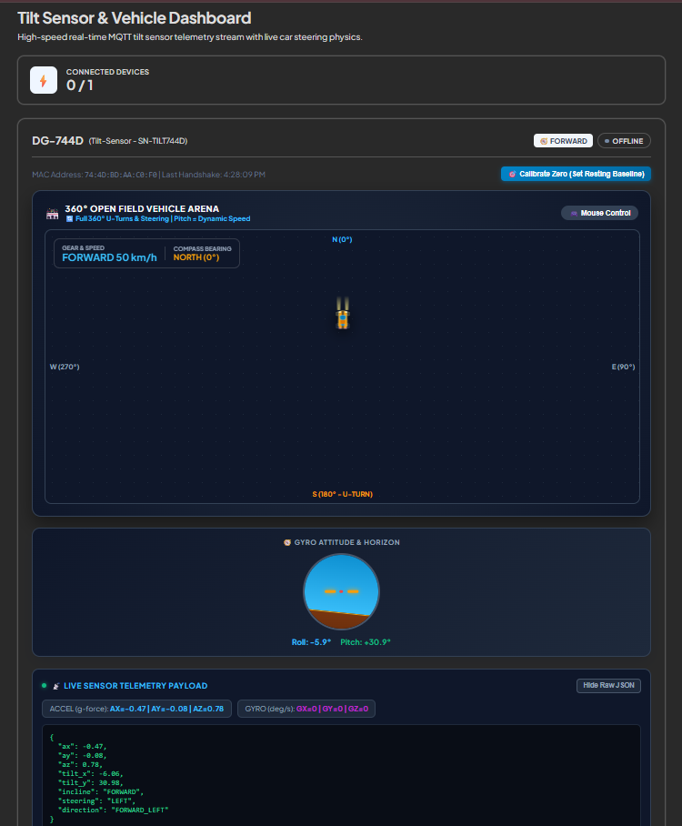

# tilt-drive

**High-speed, real-time MQTT tilt-sensor telemetry stream that drives a live car steering simulation.**

A physical tilt sensor (ESP32 + IMU) streams accelerometer and gyroscope data over MQTT. The dashboard turns that motion into a driving experience in real time — pitch controls speed, roll controls steering — inside a full 360° open-field vehicle arena.

---

## Overview

`tilt-drive` connects a physical IMU sensor node to a live web dashboard over MQTT. Instead of just plotting sensor values, it interprets them as vehicle physics — turning raw tilt data into a driving simulation with speed, steering, heading, and a live attitude horizon, all updating in real time as the sensor moves.

## Features

- **Live MQTT telemetry stream** — accelerometer (`ax`, `ay`, `az`) and gyro tilt (`tilt_x`, `tilt_y`) data streamed continuously from the sensor node
- **Tilt-to-driving physics** — pitch maps to speed/gear, roll maps to steering direction (LEFT / RIGHT / FORWARD-LEFT / FORWARD-RIGHT)
- **360° open-field vehicle arena** — the car turns, accelerates, and performs full U-turns based on live sensor input, with compass bearing tracking
- **Gyro attitude & horizon indicator** — real-time roll/pitch visualization, similar to an aircraft artificial horizon
- **Live JSON telemetry payload panel** — raw sensor data shown live for debugging and transparency
- **Device connection tracking** — MAC address, last handshake time, and online/offline status per sensor node
- **Calibrate Zero control** — sets the sensor's resting baseline on demand

## Tech stack

| Layer | Tech |
|---|---|
| Hardware | ESP32 + IMU (accelerometer/gyroscope) |
| Protocol | MQTT (real-time pub/sub) |
| Frontend | Live dashboard — SVG/canvas vehicle arena, attitude horizon, telemetry panels |
| Data flow | Sensor → MQTT broker → Dashboard subscriber → Live UI state |

## How it works

1. The tilt sensor node connects and authenticates by MAC address (e.g. device `DG-744D`).
2. It streams accelerometer and gyro tilt data continuously over MQTT.
3. The dashboard subscribes to the device's telemetry topic and:
   - Converts pitch into forward speed/gear (e.g. `FORWARD 50 km/h`)
   - Converts roll into a steering direction
   - Updates the car's position and heading inside the 360° arena
   - Redraws the gyro horizon indicator with live roll/pitch values
4. If the device goes silent, it's flagged offline while retaining its last known state.

## Status

Actively in development. Core telemetry pipeline, tilt-to-steering mapping, and live dashboard are functional.

## License

MIT
